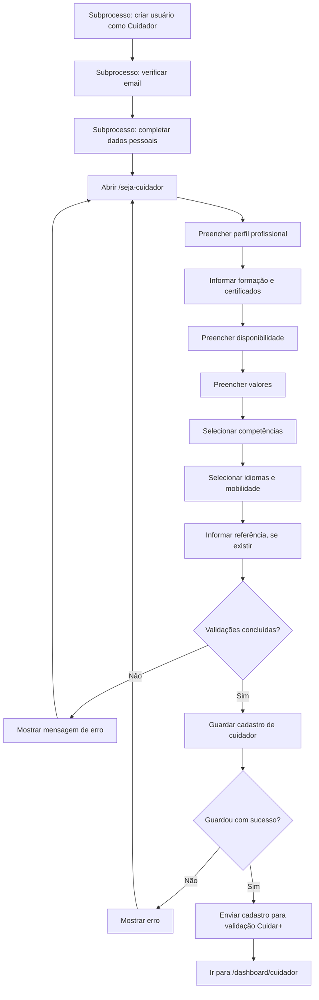
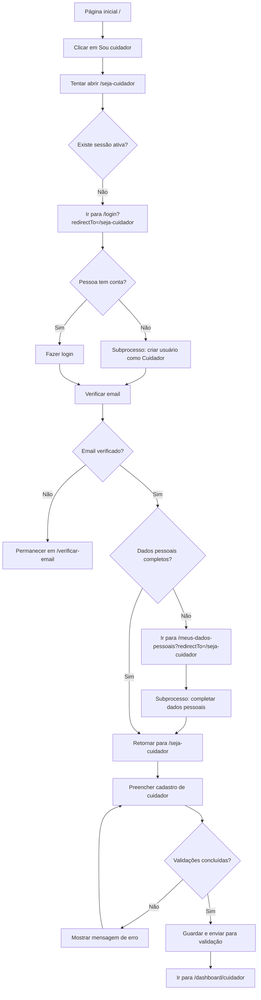
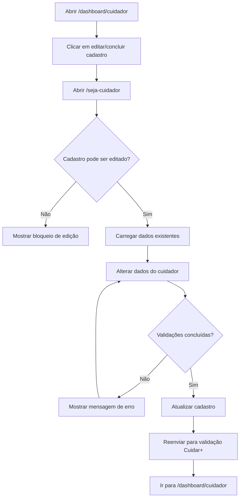

# Fluxo de Cadastro de Cuidador

Este documento descreve o fluxo não técnico do cadastro de cuidador no Portal Cuidar+.

Os fluxos de criação de usuário e dados pessoais são etapas obrigatórias prévias.

## Caminho Principal

Este caminho acontece quando a pessoa quer criar um perfil de cuidador pela primeira vez.

### Resumo

1. A pessoa cria usuário como cuidador.
2. Verifica o email.
3. Completa os dados pessoais obrigatórios.
4. Acessa `/seja-cuidador`.
5. Preenche o cadastro de cuidador.
6. Envia o cadastro para validação.
7. É redirecionada para `/dashboard/cuidador`.

## Caminho Via Botão “Sou Cuidador”

Este caminho acontece quando a pessoa entra pela página inicial e clica em `Sou cuidador`.

### Resumo

1. A pessoa clica em `Sou cuidador`.
2. Se não estiver autenticada, passa por login ou criação de usuário.
3. Se o email não estiver verificado, precisa verificar.
4. Se faltarem dados pessoais, precisa completá-los.
5. Só depois consegue preencher o cadastro de cuidador.

## Caminho de Atualização do Cadastro

Este caminho acontece quando a pessoa já possui perfil de cuidador e quer atualizar os dados.

### Resumo

1. O cuidador acessa o dashboard.
2. Abre o cadastro existente.
3. Se a edição estiver permitida, altera os dados.
4. O cadastro atualizado volta para validação.

## Campos do Cadastro de Cuidador

| Grupo | Campos |
| --- | --- |
| Perfil profissional | Resumo profissional, anos de experiência, tipos de serviço prestados. |
| Formação | Formação profissional, nome do curso, entidade formadora, data de conclusão, certificado. |
| Disponibilidade | Dias da semana, períodos, formatos de disponibilidade. |
| Valores | Valor por hora, valor por turno, valor por dia, valor mensal. |
| Competências | Competências práticas selecionadas. |
| Idiomas e mobilidade | Idiomas, carta de condução, viatura própria, aceita deslocações, raio máximo. |
| Referências | Nome, relação profissional, indicativo e telemóvel da referência. |

## Regras Percebidas Pelo Usuário

- O resumo profissional é obrigatório.
- Os anos de experiência são obrigatórios.
- É obrigatório selecionar pelo menos um tipo de serviço.
- É obrigatório selecionar pelo menos um dia da semana.
- É obrigatório selecionar pelo menos um período.
- O valor por hora é obrigatório.
- O raio máximo de deslocação é obrigatório.
- Se informar uma formação, os detalhes e o certificado passam a ser obrigatórios.
- O certificado deve ser imagem.
- O certificado deve ter no máximo 5 MB.
- Se informar contacto de referência, o telefone precisa ser válido para o indicativo selecionado.

## Resultado Esperado

Ao final do fluxo:

- O perfil de cuidador é criado ou atualizado.
- O cadastro fica com estado `pending`.
- O cadastro entra na fila de validação da Cuidar+.
- A pessoa é enviada para `/dashboard/cuidador`.
