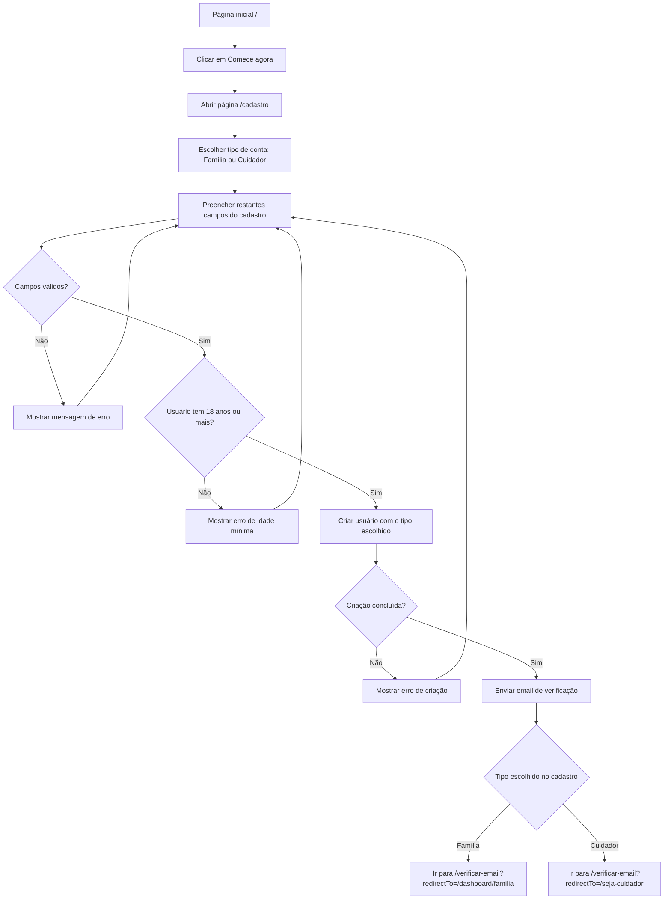
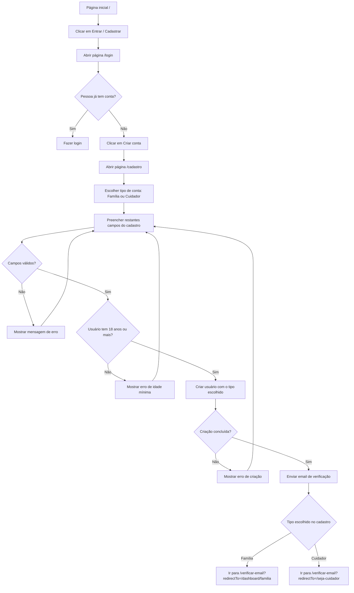
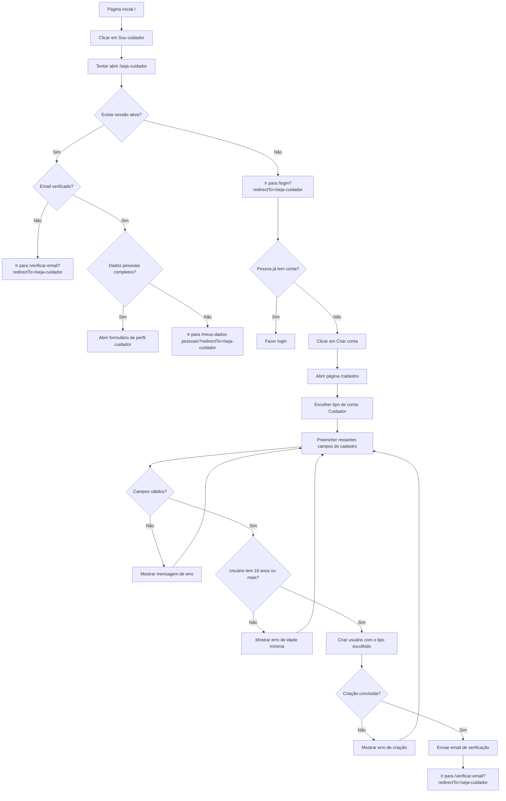

# Fluxo de Criação de Usuário

Este documento descreve o fluxo não técnico de criação de usuário no Portal Cuidar+, sem incluir a área administrativa.

O objetivo é mostrar os caminhos que levam uma pessoa até a criação da conta e o redirecionamento para verificação de email.

## Caminho Principal

Este é o caminho mais direto: a pessoa entra pela página inicial e escolhe começar o cadastro.

### Resumo

1. A pessoa acessa `/`.
2. Clica em `Comece agora`.
3. O portal abre `/cadastro`.
4. A pessoa escolhe o tipo de conta: família ou cuidador.
5. A pessoa preenche os restantes dados obrigatórios.
6. O portal valida os campos e a idade mínima.
7. Se tudo estiver correto, a conta é criada com o tipo escolhido.
8. O portal envia o email de verificação.
9. A pessoa é enviada para `/verificar-email` com o destino correspondente ao tipo escolhido.

## Caminho Via Login

Este caminho acontece quando a pessoa entra primeiro na tela de login e decide criar uma conta.

### Resumo

1. A pessoa acessa `/`.
2. Clica em `Entrar / Cadastrar`.
3. O portal abre `/login`.
4. Se ainda não tiver conta, a pessoa clica em `Criar conta`.
5. O portal abre `/cadastro`.
6. No cadastro, a pessoa escolhe o tipo de conta antes de criar o usuário.
7. O processo segue igual ao caminho principal.

## Caminho Via Sou Cuidador

Este caminho acontece quando a pessoa tenta iniciar como cuidador a partir da página inicial.

### Resumo

1. A pessoa acessa `/`.
2. Clica em `Sou cuidador`.
3. O portal tenta abrir `/seja-cuidador`.
4. Como essa rota exige sessão, a pessoa sem login é enviada para `/login?redirectTo=/seja-cuidador`.
5. Se ainda não tiver conta, segue para `/cadastro`.
6. No cadastro, a pessoa deve escolher `Cuidador` como tipo de conta antes de criar o usuário.
7. Após criar a conta, o destino de verificação é `/verificar-email?redirectTo=/seja-cuidador`.

## Campos do Cadastro

Na página `/cadastro`, a pessoa informa:

| Campo | Obrigatório |
| --- | --- |
| Tipo de conta: Família ou Cuidador | Sim |
| Nome | Sim |
| Data de nascimento | Sim |
| NIF | Sim |
| Tipo de documento | Sim |
| Número do documento | Sim |
| Email | Sim |
| Password | Sim |

## Validações Percebidas Pelo Usuário

Antes de criar a conta, o portal verifica:

- Se o tipo de conta foi escolhido.
- Se todos os campos obrigatórios foram preenchidos.
- Se o email tem formato válido.
- Se a password tem pelo menos 6 caracteres.
- Se a pessoa tem pelo menos 18 anos.

Se alguma validação falhar, o usuário permanece em `/cadastro` e recebe uma mensagem de erro.

## Resultado Esperado

Ao final do fluxo:

- A conta é criada.
- O perfil inicial do usuário é criado.
- O email de verificação é enviado.
- O usuário é encaminhado para `/verificar-email`.

Depois disso, ele ainda precisa verificar o email e completar os dados pessoais obrigatórios antes de acessar dashboards ou finalizar o perfil de cuidador.
