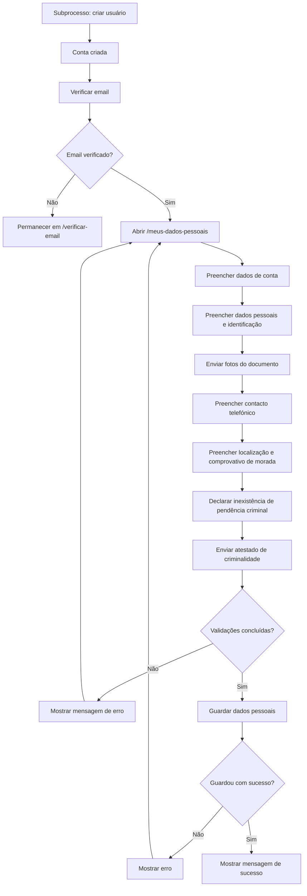
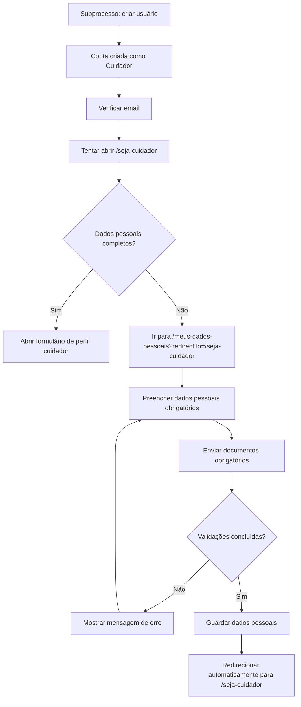
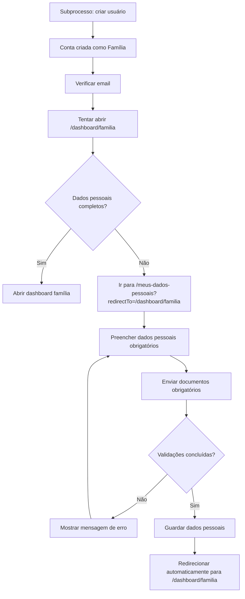

# Fluxo de Dados Pessoais

Este documento descreve o fluxo não técnico de preenchimento dos dados pessoais no Portal Cuidar+.

O fluxo de criação de usuário é tratado como uma etapa obrigatória prévia. Sem usuário criado, não é possível preencher os dados pessoais.

## Caminho Principal

Este caminho acontece quando a pessoa já tem conta criada, email verificado e entra diretamente em `Meus dados pessoais`.

### Resumo

1. A pessoa já passou pelo subprocesso de criação de usuário.
2. A pessoa verificou o email.
3. Acessa `/meus-dados-pessoais`.
4. Preenche dados de conta, identificação, contacto, localização e segurança.
5. Envia os documentos obrigatórios.
6. O portal valida tudo.
7. Se estiver correto, os dados são guardados.

## Caminho Obrigatório Antes de Criar Perfil de Cuidador

Este caminho acontece quando a pessoa tenta acessar `/seja-cuidador`, mas ainda não completou os dados pessoais.

### Resumo

1. A pessoa cria usuário como cuidador.
2. Verifica o email.
3. Tenta abrir `/seja-cuidador`.
4. Se faltar dado pessoal obrigatório, é enviada para `/meus-dados-pessoais?redirectTo=/seja-cuidador`.
5. Depois de guardar, retorna automaticamente para `/seja-cuidador`.

## Caminho Obrigatório Antes do Dashboard Família

Este caminho acontece quando a pessoa tenta acessar `/dashboard/familia`, mas ainda não completou os dados pessoais.

### Resumo

1. A pessoa cria usuário como família.
2. Verifica o email.
3. Tenta abrir `/dashboard/familia`.
4. Se faltar dado pessoal obrigatório, é enviada para `/meus-dados-pessoais?redirectTo=/dashboard/familia`.
5. Depois de guardar, retorna automaticamente para `/dashboard/familia`.

## Campos dos Dados Pessoais

Na página `/meus-dados-pessoais`, a pessoa informa:

| Grupo | Campos |
| --- | --- |
| Dados de conta | Email, aceite dos Termos e Condições, aceite da Política de Privacidade. |
| Dados pessoais | Nome completo, data de nascimento, sexo, nacionalidade, contacto telefónico. |
| Identificação | NIF, tipo de documento, número do documento, foto da frente, foto do verso quando aplicável. |
| Localização | Distrito, concelho, código postal, morada completa, foto do comprovativo de morada. |
| Registo criminal | Declaração de inexistência de pendência criminal, foto do atestado de criminalidade. |

## Regras Percebidas Pelo Usuário

- O email aparece preenchido e não editável.
- Termos e Política de Privacidade devem estar aceites.
- O telefone precisa ser válido para o indicativo selecionado.
- O documento precisa ter foto da frente.
- O documento precisa ter foto do verso, exceto quando o tipo for `Passaporte`.
- O comprovativo de morada é obrigatório.
- A declaração de inexistência de pendência criminal é obrigatória.
- O atestado de criminalidade é obrigatório.
- Cada imagem deve ser um ficheiro de imagem.
- Cada imagem deve ter no máximo 5 MB.

## Resultado Esperado

Ao final do fluxo:

- Os dados pessoais ficam guardados no perfil do usuário.
- Os documentos privados ficam associados ao usuário.
- O portal considera os dados pessoais completos.
- Se houver `redirectTo`, a pessoa é enviada automaticamente para a etapa que estava tentando acessar.
