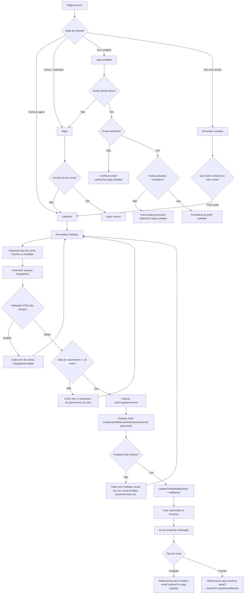

# Fluxograma da Rota Criar Usuário

Este documento descreve o fluxo atual de criação de usuário do Portal Cuidar+, partindo da página inicial até a criação da conta no Firebase Auth e do documento inicial em `users/{uid}`.

Rotas administrativas não fazem parte deste fluxo.

## Fluxograma



## Rota Principal

| Etapa | Rota | Componente | Objetivo |
| --- | --- | --- | --- |
| Entrada | `/` | `HomeComponent` | Página inicial com CTAs para famílias, cuidadores e cadastro. |
| Cadastro | `/cadastro` | `RegisterComponent` | Formulário de criação de conta comum. |
| Verificação | `/verificar-email` | `EmailVerificationComponent` | Solicita confirmação de email antes de continuar. |

## Caminhos de Entrada para Criar Usuário

### Caminho direto

1. Visitante acessa `/`.
2. Clica em `Comece agora`.
3. Portal navega para `/cadastro`.
4. Usuário preenche e submete o formulário.

### Caminho via login

1. Visitante acessa `/`.
2. Clica em `Entrar / Cadastrar`.
3. Portal navega para `/login`.
4. Se ainda não tiver conta, clica em `Criar conta`.
5. Portal navega para `/cadastro`.

### Caminho via “Sou cuidador”

1. Visitante acessa `/`.
2. Clica em `Sou cuidador`.
3. Portal tenta abrir `/seja-cuidador`.
4. Como `/seja-cuidador` é protegida por `caregiverSignupGuard`, se não houver sessão ativa o usuário é redirecionado para `/login?redirectTo=/seja-cuidador`.
5. Se ainda não tiver conta, segue para `/cadastro`.

## Formulário de Cadastro

Rota: `/cadastro`

Componente: `RegisterComponent`

Campos atuais:

| Campo | Obrigatório | Validação |
| --- | --- | --- |
| Tipo de conta | Sim | Valor selecionado no `select`. Opções atuais: `Familia` e `Cuidador`. |
| Nome | Sim | Campo obrigatório. |
| Data de nascimento | Sim | Campo obrigatório e idade mínima de 18 anos. |
| NIF | Sim | Campo obrigatório. |
| Tipo de documento | Sim | Campo obrigatório. Opções: Cartão de Cidadão, Passaporte, Título de residência, Outro. |
| Número do documento | Sim | Campo obrigatório. |
| Email | Sim | Campo obrigatório e formato de email válido. |
| Password | Sim | Campo obrigatório com mínimo de 6 caracteres. |

## Validações Antes de Criar Usuário

O componente executa as validações nesta ordem:

1. Interrompe o submit padrão do formulário.
2. Limpa a mensagem de erro anterior.
3. Percorre todos os `input` e `select` do formulário.
4. Para cada campo, chama `checkValidity()`.
5. Se o campo estiver inválido, exibe uma mensagem baseada em `data-error-label`.
6. Para `birthDate`, valida se o usuário tem pelo menos 18 anos.
7. Se alguma validação falhar, não chama o serviço de autenticação.
8. Se tudo estiver válido, monta `FormData` e chama `Auth.registerAccount`.

Mensagens de validação locais:

| Caso | Mensagem |
| --- | --- |
| Campo obrigatório vazio | `{Campo} é obrigatório.` |
| Tipo inválido, como email mal formatado | `{Campo} não está válido.` |
| Password curta | `{Campo} deve ter pelo menos {minlength} caracteres.` |
| Menor de 18 anos | `É necessário ter pelo menos 18 anos para se cadastrar.` |

## Criação no Firebase

Serviço: `Auth.registerAccount`

Após as validações locais, o serviço executa:

1. `createUserWithEmailAndPassword(firebaseAuth, email, password)`.
2. `updateProfile(credential.user, { displayName: fullName })`.
3. `setDoc(doc(firestoreDb, 'users', uid), {...})`.
4. `sendEmailVerificationMessage(credential.user)`.

## Documento Criado em `users/{uid}`

Após a criação da conta, o portal grava o documento inicial do usuário no Firestore.

Campos gravados:

```ts
{
  uid,
  email,
  fullName,
  birthDate,
  private: {
    nif,
    documentType,
    idDocument,
  },
  role,
  roles,
  caregiverProfileStatus,
  familyProfileStatus,
  familyReview,
  emailVerified,
  createdAt,
  updatedAt,
}
```

### Quando o tipo é `Cuidador`

```ts
role: 'caregiver'
roles: {
  caregiver: true,
  family: false,
}
caregiverProfileStatus: 'pending'
familyProfileStatus: null
familyReview: null
```

Destino após criação:

```txt
/verificar-email?redirectTo=/seja-cuidador
```

### Quando o tipo é `Familia`

```ts
role: 'family'
roles: {
  caregiver: false,
  family: true,
}
caregiverProfileStatus: null
familyProfileStatus: 'pending'
familyReview: {
  status: 'pending',
  requestedAt,
  lockedBy: null,
  lockedAt: null,
  decidedBy: null,
  decidedAt: null,
  rejectionReason: null,
}
```

Destino após criação:

```txt
/verificar-email?redirectTo=/dashboard/familia
```

## Erros Possíveis na Criação

Se o Firebase ou Firestore falhar, o componente captura o erro e chama `getFirebaseErrorMessage`.

Erros mapeados atualmente:

| Código | Mensagem exibida |
| --- | --- |
| `auth/email-already-in-use` | Este email já está associado a uma conta. |
| `auth/invalid-email` | O email informado não é válido. |
| `auth/weak-password` | A palavra-passe deve ter pelo menos 6 caracteres. |
| `auth/requires-recent-login` | É necessário iniciar sessão para continuar. |
| `auth/too-many-requests` | Foram feitas muitas tentativas. Aguarde alguns minutos e tente novamente. |
| `deadline-exceeded` | A operação demorou demasiado tempo. Verifique a ligação e tente novamente. |
| `failed-precondition` | Complete os seus dados pessoais antes de continuar. |
| `permission-denied` | Não foi possível gravar no Firestore. Verifique as regras de segurança. |

## Resultado Final do Fluxo

O fluxo de criação de usuário é considerado concluído quando:

1. A conta existe no Firebase Auth.
2. O `displayName` foi atualizado no Firebase Auth.
3. O documento inicial existe em `users/{uid}`.
4. O email de verificação foi enviado.
5. O usuário foi redirecionado para `/verificar-email` com o `redirectTo` adequado ao tipo de conta.

Depois disso, o usuário ainda precisa validar o email e completar os dados pessoais obrigatórios antes de acessar os dashboards ou criar o perfil de cuidador.
